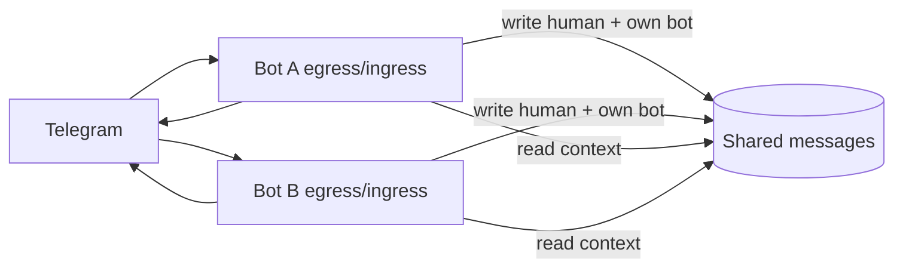

# Context bus

## Контекст

Telegram Bot API **не доставляет** сообщения bot→bot (любой privacy mode). Проверено на chat `-5492203216`: в PG Zera и SQLite Utlas — **0** строк другого бота; только human + own egress.

Meta-overclaim Zera — отдельный issue (prompt). Архитектурный обход — см. ниже.

## Идея

**Общая шина / shared store** на своём сервере — source of truth для LLM-контекста; Telegram — только **display transport** для пользователя.

1. Бот A после `sendMessage` (egress) **сразу** пишет в общую таблицу/очередь: `chat_id`, `message_id`, `sender`, `text`, `sent_at`, `transport`, …
2. Бот B (и A) при ingress **human** updates пишет туда же (как сейчас в local PG/SQLite, но в **shared**).
3. Перед генерацией **read path** (`MessageReadPort`, semantic thread, recent) читает из **shared**, не из «что долетело в webhook этого бота».

Итог: оба бота видят полный диалог независимо от Bot API filtering.

## Зачем думать

- Bot↔bot «диалог» и групповой контекст с несколькими ботами.
- Единая картина для Python Utlas + TS Zera (сейчас **две изолированные** БД).
- Основа для будущих N ботов / orchestrator steps без привязки к одному webhook.

## Вопросы для spike (не решать в issue)

### Модель данных

- Одна PG vs отдельный «context service»?
- Ключ: `(transport_type, chat_id, message_id)` — dedup при dual-write?
- Human ingress: оба бота пишут одно user-сообщение → **idempotent upsert** обязателен.
- Bot egress: только writer пишет (authoritative); второй бот не дублирует из Telegram.

### Write path

| Событие | Кто пишет в shared |
|--------|---------------------|
| User message (получен webhook) | каждый бот, кто получил update (dedup) |
| Own bot reply (egress) | автор ответа — **обязательно**, даже если Telegram «не покажет» другому боту |
| Edit message | parity с текущим edit path |

### Read path

- `buildSemanticThread` / `selectRecentBefore` → `MessageReadPort` → adapter на shared PG.
- Local PG per bot: оставить для settings/llm_calls или мигрировать всё в shared?
- Ordering: `sent_at` + `message_id`; race при почти одновременных egress?

### Multi-runtime

- Python (`ai-bot`) + TS (`utlas-ts`) — общая схема таблицы, миграции кто ведёт?
- Feature flag: `SHARED_CONTEXT_URL` / read fallback на local-only?

### Безопасность / tenancy (#47)

- Один VPS — один shared DB ok; позже: `tenant_id`, binding chat→deployment.
- Auth между ботами к shared store (localhost vs network).

### Что **не** решает

- Telegram по-прежнему не даст bot B **trigger** на сообщение bot A без human @/reply — нужен отдельный **turn policy** (отвечать ли на human-only triggers vs синтетические).
- Userbot / MTProto — out of scope.

## Эскиз (mermaid)

## Критерии «готовы брать в work»

- [ ] Решение: shared PG vs service vs event bus.
- [ ] Dedup + ordering spec для dual ingress.
- [ ] Migration path: Utlas SQLite + Zera PG → shared (или Zera first).
- [ ] Turn policy: bot↔bot triggers остаются off / only via human.
- [ ] Оценка ops: один `docker compose` stack на amsterdam2.

## Acceptance (когда дойдёт до реализации — черновик)

- [ ] Egress обоих ботов пишет в shared; read context из shared.
- [ ] В test chat оба видят сообщения друг друга в `CHAT HISTORY` (PG query / prompt dump).
- [ ] Idempotent human message при двух webhook.

## Deploy note

Пока **не менять** prod — только design. Текущий prod: изолированные БД, поведение ожидаемо.
