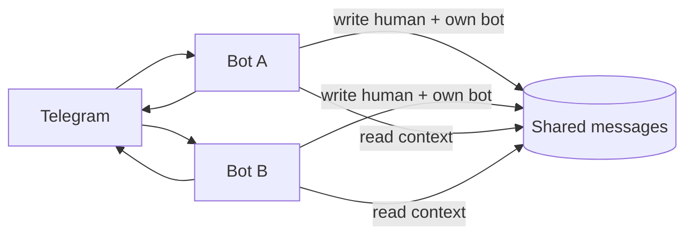

# Context bus

## Контекст

Telegram Bot API **не доставляет** сообщения bot→bot. В группе с двумя ботами каждый видит только human + свой egress — не реплики другого бота.

Архитектурный обход — shared store (ниже). Meta-overclaim в group prompt — [#20](https://github.com/skepsik/utlas-ts/issues/20).

**Не путать** с [bot-peer](../transport/peer.md): peer — HTTP-протокол (паритет Bot API getUpdates); context-bus — общая лента для compose.

## Идея

**Общая шина / shared store** — source of truth для LLM-контекста; Telegram — **display transport**.

1. Бот A после egress пишет в shared: `chat_id`, `message_id`, `sender`, `text`, …
2. Бот B при human ingress пишет туда же (dedup).
3. `MessageReadPort` / compose читают **shared**, не «что долетело в webhook этого бота».

## Зачем думать

- Bot↔bot контекст и несколько ботов в одной группе.
- Единая картина для нескольких runtime / деплоев.
- Основа для N ботов без привязки к одному webhook.

## Вопросы для spike

### Модель данных

- Одна PG vs отдельный context service?
- Ключ: `(transport_type, chat_id, message_id)` — dedup при dual-write?
- Human ingress: idempotent upsert обязателен.
- Bot egress: только writer пишет (authoritative).

### Write path

| Событие | Кто пишет в shared |
|--------|---------------------|
| User message | каждый бот, кто получил update (dedup) |
| Own bot reply | автор ответа — обязательно |
| Edit message | как edit path в [transport/telegram](../transport/telegram) § Message lifecycle |

### Read path

- `buildSemanticThread` / `selectRecentBefore` → adapter на shared PG.
- Local PG per bot: settings only или полная миграция?
- Ordering: `sent_at` + `message_id`.

### Multi-runtime

- Общая схема, миграции кто ведёт?
- Feature flag: shared URL / fallback local-only?

### Tenancy

- См. [tenancy](../tenancy.md) — `tenant_id`, binding chat→deployment.

### Что **не** решает

- Telegram не даст bot B **trigger** на сообщение bot A без human @/reply — отдельная turn policy.
- Userbot / MTProto — out of scope.

## Критерии «готовы брать в work»

- [ ] Shared PG vs service vs event bus
- [ ] Dedup + ordering spec
- [ ] Migration path к shared
- [ ] Turn policy: bot↔bot triggers off / human-only
- [ ] Ops: один stack на VPS

## Acceptance (черновик)

- [ ] Egress обоих ботов в shared; read из shared
- [ ] Test chat: оба видят реплики друг друга в CHAT HISTORY
- [ ] Idempotent human message при двух webhook

Пока **не менять** prod — только заметка.
