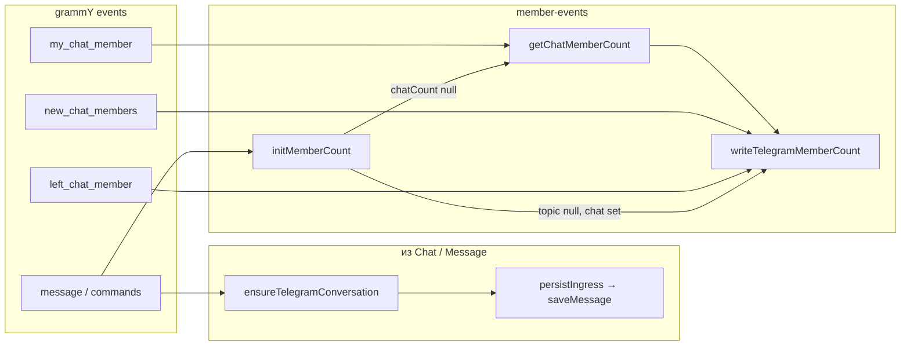
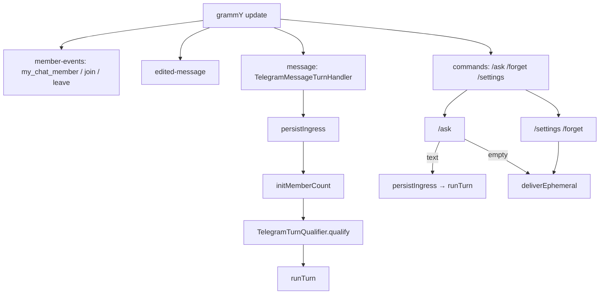

# Transport

**Transport layer** — доставка human↔assistant через messengers: ingress, qualifying, egress. Один мессенджer = подпапка `transport/<name>/`; SDK и event wiring **только** там.

Домен ([domain](./domain.md)) agnostic: `MessageRef`, turn. Transport нормализует сырой event → `MessageRef` и обратно.

**Сейчас:** Telegram v0 — [checklist](#v0-checklist) ниже. Conversation identity (uuid + `external_key`, forum topics, `dialogArity`, member events) — [#81](https://github.com/skepsik/utlas-ts/issues/81).

---

## Conversation identity ([#81](https://github.com/skepsik/utlas-ts/issues/81))

**Атом разговора** — `conversations.id` (uuid). Domain / turn / storage видят только uuid в `MessageRef.conversationId`. Transport склеивает wire key в `external_key`; decode обратно — только в `transport/telegram/`.

### `external_key` (Telegram)

| Случай | `external_key` | Пример |
|--------|----------------|--------|
| Любой чат без forum thread | `tg:{chat_id}` | `tg:-100123` |
| Forum topic (не General) | `tg:{chat_id}:t{thread_id}` | `tg:-100123:t42` |
| General (`message_thread_id === 1`) | без суффикса | `tg:-100123` |

Encode: `encodeTelegramConversationKey(chatId, messageThreadId?)`. Decode: `decodeTelegramConversationKey` → `{ chatId, messageThreadId? }`. Egress: `telegramWireTarget(pg, conversationId)` по uuid.

**Ingress:** `Message` → `ensureTelegramConversation` → `saveMessage`.  
**Commands / egress:** тот же helper; `getConversationRecord` для user settings; `telegramChatMembershipInfo` для `MembershipInfo` / qualifying.

`ensureTelegramConversation(pg, chat, messageThreadId?)` — тонкая обёртка: `encodeTelegramConversationKey` + `conversationRowTitlePartialFromChat` + `ensureConversation` → `{ conversationId, externalKey }`. **Не hub**, без optional `api` на message path; interim до [#99](https://github.com/skepsik/utlas-ts/issues/99) (`ConversationWireStore.ensure`).

Forum topic = **отдельная** row в `conversations` (свой uuid, watermark, settings). **`member_count` и `dialog_arity` — denorm на chat-level и на topic rows**, которые уже есть в PG на момент write (`writeTelegramMemberCount` → `updateConversationMembershipInfoByKeys`). Новый topic-row после write остаётся с `null`, пока не сработает member-event или `initMemberCount` (backfill с chat-level, без API).

**Qualifying / turn read:** всегда chat-level — `telegramChatMembershipInfo(pg, chat)` → `MembershipInfo` → `dialogArity` getter. Topic-row count/arity для turn **не** читаются.

### Маппинг Chat → row (не «meta»)

Transport — однонаправленный поток событий; **без hub'ов** и без optional `api` на message path.

| Слой | Имя | Роль |
|------|-----|------|
| transport | `telegramChatTitle(chat)` | title из grammY `Chat` |
| transport | `conversationRowTitlePartialFromChat(chat)` | `{ title? }` для upsert |
| storage | `ConversationRowTitlePartial` | chat-known поля на upsert (`title?`) |
| transport | `ensureTelegramConversation(pg, chat, threadId?)` | encode + title patch + `ensureConversation` ([#92](https://github.com/skepsik/utlas-ts/issues/92)) |
| storage | `ensureConversation(pg, transport, externalKey, patch?)` | uuid row (storage; transport via helper) |
| transport | `membershipInfoFromTelegramChat(chat, count)` | `chat.type` + count → `MembershipInfo` |
| transport | `telegramChatMembershipInfo(pg, chat)` | chat-level count из PG + boundary VO |
| storage | `updateConversationMembershipInfoByKeys` | bulk write `member_count` + effective `dialog_arity` |

`transport` tag — аргумент `TELEGRAM_TAG` на call site, не поле patch.



### `MembershipInfo`, member_count и member events

| Источник | Действие |
|----------|----------|
| `my_chat_member` (бот в чате) | `getChatMemberCount` → `writeTelegramMemberCount` (chat + все topic rows в PG) |
| `new_chat_members` | `+delta` (все в списке, включая ботов) от chat-level count; **без API** |
| `left_chat_member` | `−1` (включая ботов); **без API** |
| `message` (turn-path) | после `persistIngress`: `initMemberCount` — идемпотентно по PG (см. ниже); **не** на `/ask` |
| ingress (`persistIngress`) | **не трогает** count/arity |
| qualifying / turn | `telegramChatMembershipInfo` → `MembershipInfo.dialogArity` |

**`writeTelegramMemberCount`:** `membershipInfoFromTelegramChat(chat, count)` → `updateConversationMembershipInfoByKeys` на `[chatKey, …topicKeys]` (topic keys — `listExternalKeysByPattern`).

**`initMemberCount`** (только group/supergroup, только generic `message` handler):

| Состояние PG | Действие |
|--------------|----------|
| chat-level `member_count` null | `getChatMemberCount` → `writeTelegramMemberCount` |
| chat-level заполнен, не forum-topic | skip (один read) |
| chat-level заполнен, forum-topic, topic-row null | `writeTelegramMemberCount(chatCount)` — backfill denorm, **без API** |
| оба заполнены | skip |

Явного счётчика «первого вызова» нет — только `null` / not `null` в PG.

**Не делаем:** bootstrap count на **каждое** сообщение; протаскивание `api` через ingress; hub `resolveTelegramConversation` / `TelegramRuntime`. Welcome — [#87](https://github.com/skepsik/utlas-ts/issues/87).

**Qualifying / turn:** `TelegramTurnQualifier.qualify` (или `qualifiesForTurn`) — effective arity из `MembershipInfo`, не сырой `chat.type`.

---

## Термины

| Термин | Смысл |
|--------|--------|
| **Ingress** | Сырой event → `MessageRef` → persist. Quote, forward, reply, `sentAt`, participant — здесь. |
| **Egress** | Ответ наружу: wire (HTML, threading) + опциональный persist. Turn и handlers знают только **`OutboundPort.deliver`**. |
| **Qualifying** | «Это обращение к **нашему** binding?» — transport-specific, **до** `runTurn`. |
| **Transport** | Ingress + qualifying + egress + wiring для одного мессенджера. |

Ingress = трафик в систему, egress = из системы.

---

## Зачем `transport/`, а не SDK в корне

- Один мессенджer = одна подпапка; снаружи — `createTelegramBot` / registry.
- Новый transport — новая папка + регистрация; domain/turn/storage не трогаем.
- Правило: **grammY (и любой messenger SDK) только под `transport/telegram/`**.

---

## Дерево (as implemented)

```
transport/
  types.ts                OutboundPort, OutboundContext, Transport, …
  text-chunking.ts        splitTextForLimit, sendTextInChunks ([#101](https://github.com/skepsik/utlas-ts/issues/101))
  turn-qualification.ts   TurnQualification + TurnQualificationFactory
  factory.ts              createTransport (type guard)
  registry.ts             TransportRegistry
  index.ts

  telegram/
    bot.ts                createTelegramBot → Transport; register listeners
    constants.ts, texts.ts, format.ts
    chat.ts               title, MembershipInfo boundary
    ingress.ts            tgMessageToRef, persistIngress
    forward.ts            parseQuote, parseForward, parseForwardLabel
    qualify.ts            TelegramTurnQualifier; qualifiesForTurn, shouldRespondInGroup
    conversation-key.ts   encode/decode external_key; telegramWireTarget (egress)
    conversation/
      ensure.ts           ensureTelegramConversation ([#92](https://github.com/skepsik/utlas-ts/issues/92))
    egress.ts             createTelegramOutboundPort, wire + persist by policy
    egress/
      ephemeral-context.ts   outboundContextFromTelegramMessage, deliverEphemeral*
    listeners/
      types.ts            ListenerDeps (+ Pick views)
      member-events.ts    member events, initMemberCount, writeTelegramMemberCount
      edited-message.ts   edited_message → updateMessageText
      message.ts          TelegramMessageTurnHandler (generic message path)
      commands/
        index.ts            TelegramCommands — registerCommands
        ask.ts, forget.ts, settings.ts
    index.ts              createTelegramBot
```

**Вне transport/** (agnostic): `@utlas/core` (`domain/`, `storage/`, `llm/`), `apps/runtime` (`turn/`, `enrichment/`, `clients/`, `orchestrator/`, `main.ts`).

### Class vs function (telegram)

| Class | Function / module |
|-------|-------------------|
| `createTelegramOutboundPort` (port impl) | `encodeTelegramConversationKey`, `decodeTelegramConversationKey`, `telegramWireTarget` |
| `TelegramTurnQualifier` | `qualifiesForTurn`, `shouldRespondInGroup` (thin exports) |
| `TelegramMessageTurnHandler` | `persistIngress`, `tgMessageToRef`, parse* in `forward.ts` |
| `TelegramCommands` | `handleAskCommand`, `handleForgetCommand`, settings handlers |
| — | `ensureTelegramConversation`, `conversationRowTitlePartialFromChat`, `deliverEphemeral*` |
| — | `splitTextForLimit`, `sendTextInChunks` ([#101](https://github.com/skepsik/utlas-ts/issues/101)) |

Resolver/hub-классы (`TelegramRuntime`, `resolveTelegramConversation`) — **не** вводим ([#88](https://github.com/skepsik/utlas-ts/issues/88)).

---

## Ports (`transport/types.ts`)

### OutboundPort ([#69](https://github.com/skepsik/utlas-ts/issues/69))

Единый egress наружу: **wire + persist по policy** в одном вызове. Не `BotEgress`, не `TurnEgress`, не domain `Utterance`.

```ts
type ConversationOutboundItem =
  | { kind: "text"; body: string }
  | { kind: "map_pin"; lat: number; lon: number; label: string };

/** history = messages / CHAT HISTORY; ephemeral = wire only */
type OutboundPersistPolicy = "history" | "ephemeral"; // default: history

type OutboundPort = {
  deliver(
    item: ConversationOutboundItem,
    ctx: OutboundContext,
    persist?: OutboundPersistPolicy,
  ): Promise<MessageRef | void>;
};
```

Impl: `createTelegramOutboundPort({ api, pg })` в `telegram/egress.ts`. Turn, tool runners и transport handlers вызывают **`deliver`**; grammY не импортирует из `turn/`.

### OutboundContext ([#89](https://github.com/skepsik/utlas-ts/issues/89))

DTO одного `deliver`: куда слать и как persist. **Trigger** (сообщение, открывшее turn / command) и **wire reply** — разные поля.

```ts
type OutboundContext = {
  conversationId: string
  conversation: OutboundConversation
  triggerMessageId?: string   // semantic: audit, persist anchorRef
  replyToMessageId?: string   // wire only; undefined → без reply_parameters
}
```

| Поле | Смысл |
|------|--------|
| `triggerMessageId` | id trigger-сообщения; persist `anchorRef` / audit |
| `replyToMessageId` | только wire (`reply_parameters` в TG); **по умолчанию не задаётся** |

**Сборщики:**

| Путь | Функция | `replyToMessageId` |
|------|---------|-------------------|
| Turn answer / map_pin | `turn/outbound-context.ts` → `outboundContextForTurn(..., "replyToTrigger")` | domain `replyTargetForTrigger` |
| Ephemeral в turn (debug, errors) | `outboundContextForTurn(...)` без preset | не задаётся |
| Commands / UI вне turn | `egress/ephemeral-context.ts` → `outboundContextFromTelegramMessage` | не задаётся |

**Threading policy (v0):** не «всегда reply на anchor». Classic turn egress передаёт preset **`replyToTrigger`**; без preset — **none** (поле отсутствует). Правило «когда reply уместен» — domain `replyTargetForTrigger` ([domain](./domain.md) § Outbound reply threading); transport egress только мапит `replyToMessageId` на wire.

**Три оси (не смешивать):**

| Ось | Что | Где |
|-----|-----|-----|
| **Conversation item** | Вид для пользователя / CHAT HISTORY | `ConversationOutboundItem`: `text`, `map_pin`, … |
| **Persist policy** | История vs временный вывод в чат | 3-й аргумент `deliver`, **не** поле внутри `kind` |
| **Observability** | `llm_calls`, `generation_failures`, `console.*` | **вне** `OutboundPort` |

`log` — **не** `kind` рядом с `map_pin`. Debug/trace в TG = `deliver(..., "ephemeral")`.

**Матрица (v1):**

| Запись | Egress (чат) | `persist` | Куда |
|--------|--------------|-----------|------|
| Ответ модели (`shouldReply`) | да | `history` | `messages` |
| Map pin | да | `history` | `messages` + `map_pin` payload |
| Debug: `DEBUG_SILENT`, ошибки в debugMode | да | `ephemeral` | операторский trace в TG |
| User-visible LLM error (не debug) | да | `ephemeral` | короткий текст в TG |
| UI вне turn (`/settings`, `/forget`, пустой `/ask`) | да | `ephemeral` | подтверждение / статус |
| LLM invoke audit | нет | — | `llm_calls` (llm-слой) |
| Generation incident (fail turn) | по политике (см. § ниже) | `ephemeral` или нет | `generation_failures` (**всегда**) |
| `console.*` | нет | — | ops |

Turn / tools выбирают `item` + `persist`; `OutboundContext` — через сборщики выше. Port — wire + сохранение.

**Reject:** `send`/`push` как имя порта; `log` как `kind`; склейка policy внутри `egress.ts` по `debugMode` для save.

**Позже:** `InboundPort.ingest` ≈ `persistIngress` (имя зафиксировано; порт — не в v1).

### Generation failures ([#76](https://github.com/skepsik/utlas-ts/issues/76))

Единая обработка ошибок generation: **durable audit** + **ephemeral egress** из одного handler'а — не размазывать по catch'ам.

**Impl:** `handleGenerationFailure` в `apps/runtime/src/turn/handle-generation-failure.ts`; вызывается из `runGeneration` и safety net на reject `GenerationTask` (`run-turn.ts`).

```text
любой перехваченный fail generation
  → console.error
  → logGenerationFailure (PG, всегда; не зависит от debugMode)
  → failureEgressText → optional OutboundPort.deliver(..., ephemeral)
```

**Две оси observability (не смешивать):**

| Store | Роль |
|-------|------|
| **`llm_calls`** | Audit **invoke**: latency, provider, `status: ok \| error` на границе `generateReply` |
| **`generation_failures`** | **Incidents** turn: фаза, `error_text`, `http_code`, `trigger_message_id` |

Один LLM error даёт **обе** записи: `llm_calls` (invoke) + `generation_failures` (incident + egress policy).

**Фазы** (`GenerationFailurePhase`): `llm` | `tool` | `egress` | `settings` | `other`.

| Фаза | Откуда |
|------|--------|
| `llm` | `generateReply` / compose / enrichment read в том же `try` |
| `tool` | `runToolLoop` |
| `settings` | `applyConversationSettings` после успешного answer |
| `egress` | `outbound.deliver` ответа модели |
| `other` | reject `GenerationTask` вне `runGeneration` |

**Ephemeral egress** (`failureEgressText`):

| `debugMode` | Фаза | Чат |
|-------------|------|-----|
| on | любая | `formatDebugError(err)` |
| off | `llm` | короткий `LLM_ERROR` |
| off | `tool` / `egress` / `settings` / `other` | тишина |

`sendEphemeralEgress` уважает supersede (`shouldDiscardOnSend`) — как обычный egress.

**Вне handler'а:**

- **Enrichment** — swallow + пустой fragment (`enrichTurn`); отдельная политика, не `generation_failures`
- **Abort** (`AbortError`) — без audit и без egress
- **Debug silent** (`shouldReply: false` + `debugMode`) — `sendEphemeralEgress(DEBUG_SILENT)`, не failure

Schema: [storage-mapping](./storage-mapping.md) § `generation_failures`. Тесты матрицы: `apps/runtime/test/turn-generation-failure.test.ts` ([#80](https://github.com/skepsik/utlas-ts/issues/80)).

### Слой / pipeline / порт

| Уровень | Вход | Выход |
|---------|------|--------|
| **Слой transport** | ingress | egress |
| **Шаг pipeline** (orchestrator YAML) | `ingress` | `deliver` |
| **Метод порта** | `ingest` (later) | **`deliver`** |

`StepRegistry` регистрирует orchestrator-step `"deliver"` (stub [#58](https://github.com/skepsik/utlas-ts/issues/58)); runtime egress — тот же `OutboundPort`.

### Transport

```ts
Transport { type: string; start(): Promise<void>; stop(): Promise<void> }
```

Impl: `createTelegramBot(...)` — `OutboundPort` + `registerMemberEvents` / `registerEditedMessage` / `registerCommands` / `registerMessageTurn` в `bot.ts`.

### TurnQualification (`transport/turn-qualification.ts`)

Boundary type для qualifying — **не** domain entity:

```ts
| { qualifies: true; via: "private" | "mention" | "reply_to_bot" }
| { qualifies: false; reason: "not_for_bot" | "bot_off" | "command" }
```

Factory: `TurnQualificationFactory.qualified / .rejected`.

**v0:** `TelegramTurnQualifier` → `private | mention | reply_to_bot | not_for_bot`.  
`bot_off` — зарезервирован; **`bot_enabled` проверяется в `runTurn`**, не в trigger.

---

## Telegram — handler flow

Wiring в `bot.ts` — один `ListenerDeps`, без hub-класса ([#91](https://github.com/skepsik/utlas-ts/issues/91)).



```
grammY update
  bot.catch → log update error
  ├─ my_chat_member / new_chat_members / left_chat_member → member-events.ts
  ├─ edited_message → edited-message.ts → updateMessageText
  ├─ bot.command:
  │   ├─ /settings  → settings.ts → ephemeral (не runTurn)
  │   ├─ /forget    → forget.ts → reset watermark + ephemeral
  │   └─ /ask       → ask.ts → persist + runTurn | empty → ephemeral
  └─ message        → message.ts → persist → initMemberCount → qualify → runTurn
```

`api` на message path **не** протаскивается: `getChatMemberCount` — в `member-events` / `initMemberCount`; `getChatMember` — только admin check в `/settings`.

**Persist до gate** на generic `message` — сообщения без qualifying тоже в PG.

Generic `message` **пропускает** строки `message.text?.startsWith("/")` (interim; ложные срабатывания на `/** … */` — [#102](https://github.com/skepsik/utlas-ts/issues/102)).

### Commands ([#90](https://github.com/skepsik/utlas-ts/issues/90))

| Команда | Persist ingress | `runTurn` | Egress |
|---------|-----------------|-----------|--------|
| `/settings` | ensure row only | нет | `ephemeral` (статус / подтверждение) |
| `/forget` | нет | нет | `ephemeral` после watermark |
| `/ask` (пустой) | нет | нет | `ephemeral` |
| `/ask` (текст) | да (`persistIngress`) | да (`TurnRequest.fromAsk`) | `history` через turn |
| generic `message` | да | если qualify | `history` через turn |

Commands **вне** generic `message` handler; `/ask` **обходит** qualifying.

### Ingress (`ingress.ts` + `forward.ts` + `chat.ts`)

- `ensureTelegramConversation` → uuid
- `tgMessageToRef` → `saveMessage` — **не трогает** `member_count` / `dialog_arity`

### Egress вне turn (`egress/ephemeral-context.ts`)

- `deliverEphemeralFromMessage(outbound, pg, message, body)`
- `outboundContextFromTelegramMessage` — ensure + `getConversationRecord`; **без** `replyToMessageId`

### Qualifying (`qualify.ts`)

`TelegramTurnQualifier.qualify(message, dialogArity)`; `dialogArity` из `MembershipInfo.dialogArity` (**не** сырой `chat.type`).

| `dialogArity` / условие | `via` |
|-------------------------|-------|
| `private` | `private` (все сообщения в 1:1 или duo) |
| `group` + reply на сообщение бота | `reply_to_bot` |
| `group` + `@mention` бота в entities | `mention` |
| `group`, иначе | reject `not_for_bot` |

### Egress (`egress.ts` + `format.ts` + `conversation-key.ts`)

- `telegramWireTarget(pg, conversationId)` — uuid → `chat_id` + `message_thread_id?`
- `createTelegramOutboundPort.deliver` — единая точка wire + persist
- `markdownToTelegramHtml` → `parse_mode: "HTML"`; fallback plain text при ошибке API
- **Длинный text** ([#101](https://github.com/skepsik/utlas-ts/issues/101)): generic `splitTextForLimit` + `sendTextInChunks` в `transport/text-chunking.ts`; telegram `sendTextWire` передаёт `TELEGRAM_MAX_TEXT_LENGTH` (4096) и делегирует в `telegramSendTextOnce` (один `sendMessage` на кусок). Посимвольный split; резка по HTML после escape — out of scope.
- **Multi-chunk policy (v0):** `replyToMessageId` только на **первый** chunk; `persist: "history"` — одна row с полным `body`, id первого wire-сообщения
- `persist: "history"` — persist исходящего с `sender.isBot`, `anchorRef` = `triggerMessageId`
- `persist: "ephemeral"` — только wire, **без** row в `messages`
- **Map pin** ([#65](https://github.com/skepsik/utlas-ts/issues/65)): `kind: "map_pin"` → `sendLocation` + `MessagePayload` в PG — [tools/composite](./tools/composite.md) § Память; runner вызывает `OutboundPort.deliver`, не grammY из `turn/`

См. [domain](./domain.md) § Outbound reply threading.

### Message lifecycle: edit / delete

Transport отвечает только за **синхронизацию PG с тем, что мессенджer сообщил**. Turn/LLM — отдельно.

| Событие | Telegram v0 | Политика |
|---------|-------------|----------|
| **Edit** (`edited_message`) | ✅ приходит | `edited-message.ts` → `updateMessageText`: обновить **только** `messages.text`. Quote / forward / reply / `sentAt` **не** пересчитывать. **Без** `runTurn`. |
| **Edit → пусто** (текст и caption сняты) | ✅ как edit | Считать **очисткой контента**, не delete row: persist `text = ""`. *(Сейчас skip — stale; small fix в transport.)* |
| **Delete** (сообщение исчезло без edit) | ❌ Bot API не шлёт update в private/group | Row в PG **не удалять** — last-known snapshot. Reply-chain и `llm_calls` ссылаются на `message_id`. |
| **Delete** (другие transport / Business API) | later | Опционально `deleted_at` + tombstone; row по-прежнему не DELETE. |

**Не делаем на transport:**

- hard `DELETE` из `messages`
- regen ответа бота при edit — **turn** (later)

**Принцип:** PG — append-only archive по `(conversation_id uuid, message_id)`; transport правит только поля, которые реально пришли в update.

---

## Transport tag на boundary

Transport tag — conversation scope, не utterance. Ingress: `TELEGRAM_TAG` в `saveMessage` и `TurnRequest.fromMessage({ transport })`; prompt — `ctx.transport`. **Не поле `MessageRef`.** [#33](https://github.com/skepsik/utlas-ts/issues/33) ✅. Hub: [domain](./domain.md) § Transport tag.

## Стык с turn

```ts
// membershipInfo — telegramChatMembershipInfo после persistIngress (+ initMemberCount на message path)
TurnRequest.fromMessage({ anchor, membershipInfo, outbound, services, supersedeMaxGapMs, transport })
TurnRequest.fromAsk({ ... , text, membershipInfo, outbound, transport })
// request.arity === membershipInfo.dialogArity
```

Turn pipeline **не** импортирует grammY. Egress только через **`OutboundPort`** на request.

Composition root (`main.ts`): `createTelegramBot` + `TransportRegistry.register`; `turnServices.messageReadPort = PostgresContextRead`.

---

## Enrichment

**v0:** `runEnrichment` в `runTurn` (turn-hook), не ingress transform.

Ingress transform chain (`enrichment → capture`) — later; см. enrichment registry.

---

## Transport ≠ connectors

| | Transport | Clients |
|---|-----------|------------|
| Назначение | Messengers: ingress / egress | Внешние API (Obsidian, Jira, …) |
| Registry | `TransportRegistry` | `ClientRegistry` |
| Domain | `MessageRef` in/out | bindings, orchestrator steps |

**Git deploy** — `infra/`, не connector.

---

## Тесты (v0)

`test/transport-telegram.test.ts`:

- `membershipInfoFromTelegramChat` (wire + duo → effective private)
- `parseQuote`, `parseForward`, `parseForwardLabel`
- `tgMessageToRef` (quote-only, forward)
- `qualifiesForTurn` / `shouldRespondInGroup` (private arity, mention, reply, reject)

`test/conversation-key.test.ts` — encode/decode, General topic.  
`test/dialog-arity-persist.test.ts` — `updateConversationMembershipInfoByKeys` на topic row.  
`test/member-handlers.test.ts` — join/leave, `initMemberCount`, bulk write.  
`test/ingress-conversation.test.ts` — forum topic uuid / general key.  
`test/commands-ask.test.ts` — `/ask` empty vs text path ([#90](https://github.com/skepsik/utlas-ts/issues/90)).  
`test/text-chunking.test.ts` — split + reply-on-first policy ([#101](https://github.com/skepsik/utlas-ts/issues/101)).  
`test/outbound-deliver.test.ts` — deliver policies, long text multi-send.

---

## v0 checklist

- [x] `transport/telegram/`; grammY только там
- [x] Ingress: text, quote, forward, reply, links, persist
- [x] Qualifying: private / @mention / reply_to_bot
- [x] `/ask`, `/forget`, `/settings`
- [x] Egress: HTML, chunk, reply threading, `OutboundPort.deliver` + `history` / `ephemeral`
- [x] `edited_message` → update text in PG (см. § Message lifecycle)
- [x] Delete policy: no row DELETE; Telegram delete N/A v0
- [x] `OutboundPort`; turn без SDK import ([#69](https://github.com/skepsik/utlas-ts/issues/69))
- [x] Egress вне turn через тот же port ([#75](https://github.com/skepsik/utlas-ts/issues/75))
- [x] `TurnQualification` boundary type
- [x] Listeners layout: `listeners/` + `commands/` ([#91](https://github.com/skepsik/utlas-ts/issues/91))
- [x] `ensureTelegramConversation` DRY ([#92](https://github.com/skepsik/utlas-ts/issues/92))
- [ ] Ingress transform (STT / enrichment pre-capture) — later
- [x] Media / caption-only без текста
- [x] Egress delivery model: `triggerMessageId` / `replyToMessageId`, domain `replyTargetForTrigger` ([#89](https://github.com/skepsik/utlas-ts/issues/89))
- [x] Conversation uuid + `external_key`; forum topics ([#81](https://github.com/skepsik/utlas-ts/issues/81) #82–#84)
- [x] Member events + `initMemberCount` + bulk denorm `member_count` / `dialog_arity` ([#81](https://github.com/skepsik/utlas-ts/issues/81) #85)
- [x] `MembershipInfo` + qualifying из effective arity ([#81](https://github.com/skepsik/utlas-ts/issues/81) #86)

---

## Open

- [ ] **`bot_off` в TurnQualification** — перенести check из `runTurn` в trigger или убрать из type
- [ ] **Command skip heuristic** — `startsWith("/")` vs Telegram `bot_command` entity ([#102](https://github.com/skepsik/utlas-ts/issues/102))
- [ ] **Ingress↔egress symmetry** — `ConversationWireStore` ([#99](https://github.com/skepsik/utlas-ts/issues/99))

## Later

- [ ] **Second transport** — шаблон подпапки + registry factory
- [ ] **Ingress enrichment** — hook до `persistIngress`
- [ ] **Multi-bot** — qualifying на self binding per [tenancy](./tenancy.md)
- [ ] **Empty edit → `text=""`** — transport (`edited-message.ts`)
- [ ] **LLM regen on edit** — turn, не transport
