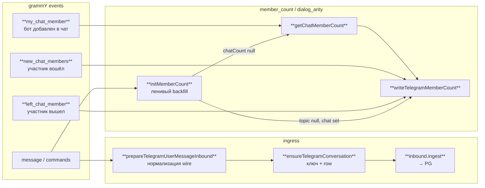
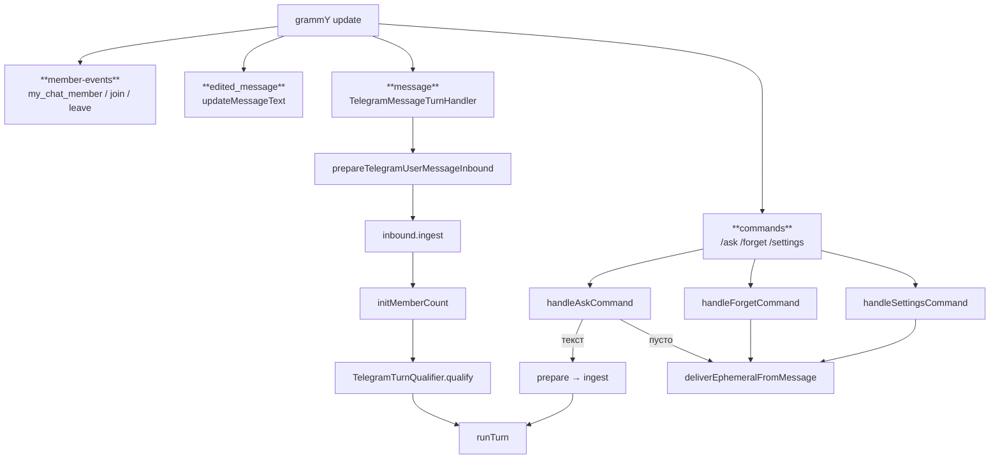

# Transport — Telegram

Единственная реализация transport v0. Общие порты и термины — [transport](./index.md).

grammY и подписка на update'ы — только здесь. Turn видит uuid, `MessageRef` и порты; chat id и thread id — только на этой границе.

---

## Identity разговора ([#81](https://github.com/skepsik/utlas-ts/issues/81))

**Атом разговора** в PG — `conversations.id` (uuid). Domain, turn и storage везде опираются на uuid в `MessageRef.conversationId`. Wire-идентификатор чата (и опционально forum-topic) хранится в `external_key`; обратный маппинг uuid → куда слать ответ — тоже только в transport.

### Формат `external_key`

| Случай | `external_key` | Пример |
|--------|----------------|--------|
| Чат без forum-thread | `tg:{chat_id}` | `tg:-100123` |
| Forum topic (не General) | `tg:{chat_id}:t{thread_id}` | `tg:-100123:t42` |
| General (`message_thread_id === 1`) | как чат без thread | `tg:-100123` |

При ingress из update'а: по chat id и thread строим ключ, находим или создаём row в `conversations`, при необходимости обновляем заголовок чата ([#92](https://github.com/skepsik/utlas-ts/issues/92)).

При egress: по uuid читаем ключ через `store.getExternalKey` и получаем `chat_id` + `message_thread_id` для API (`telegramWireTarget`). Row ensure/settings — через `ConversationWireStore` в handler deps ([#98](https://github.com/skepsik/utlas-ts/issues/98), [#99](https://github.com/skepsik/utlas-ts/issues/99)).

**Forum topic** — отдельный разговор: свой uuid, watermark и settings. Это не «метаданные» одного чата, а самостоятельная row.

**Число участников и arity** денормализуются на row чата и на row каждого topic, который уже есть в PG: при join/leave или явном запросе к API счётчик пересчитывается и копируется на все связанные keys. Новый topic, появившийся после такого write, остаётся без count, пока не придёт member-event или не сработает ленивый backfill с chat-level — без лишнего API на каждое сообщение.

Для qualifying и turn **всегда** берём arity **чата целиком** (chat-level), не row отдельного topic — иначе группа с темами вела бы себя как private в одной ветке.

| Операция | В коде |
|----------|--------|
| Ключ wire ↔ chat/thread | `encodeTelegramConversationKey`, `decodeTelegramConversationKey` |
| Row чата (ingress) | `ensureTelegramConversation(store, …)` → `store.ensure` |
| uuid → wire (egress) | `telegramWireTarget` → `store.getExternalKey` / `store.getRecord` |
| Arity для turn | `TelegramMembershipResolver.forChat` → `membershipInfoFromTelegramChat` |
| Member events write | `store.syncMembership`, `store.getMemberCount` |



### События участников

| Событие Telegram | Поведение | В коде |
|------------------|-----------|--------|
| `my_chat_member` | Запросить число участников у API, записать на chat и все topic rows в PG | `getChatMemberCount` → `writeTelegramMemberCount` |
| `new_chat_members` | Увеличить chat-level count на размер списка (включая ботов), размазать на topic rows; **без** API | `writeTelegramMemberCount` (+delta) |
| `left_chat_member` | Уменьшить на 1 (включая ботов), размазать; **без** API | `writeTelegramMemberCount` (−1) |
| `message` (turn-path) | После persist: если count ещё не был — один раз добить через API или backfill с chat; **не** на `/ask` | после `inbound.ingest` → `initMemberCount` |
| persist ingress | Count и arity **не** меняет | `inbound.ingest` |
| qualifying / turn | Effective arity с chat-level | `TelegramMembershipResolver.forChat` |

В группах и супергруппах на generic message-path действует ленивая инициализация: пустой chat-level → API; chat уже знает count, а topic-row пуст → копируем с chat; иначе ничего.

**Не делаем:** пересчёт на каждое сообщение; протаскивание API client через ingress; hub-классы resolver/runtime ([#88](https://github.com/skepsik/utlas-ts/issues/88)).

---

## Поток обработки update ([#91](https://github.com/skepsik/utlas-ts/issues/91))

Один composition root подписывает grammY: member-events, правки сообщений, команды и generic message — отдельные ветки, без общего hub-класса.



Сообщения **сохраняются до qualifying** — то, что не адресовано боту, тоже остаётся в PG.

На message-path API client **не** тащится: запросы к Telegram только в member-events и admin-check для `/settings`.

Строки, начинающиеся с `/`, generic handler пока отбрасывает эвристикой `startsWith` — ложные срабатывания возможны ([#102](https://github.com/skepsik/utlas-ts/issues/102)).

### Commands ([#90](https://github.com/skepsik/utlas-ts/issues/90))

| Команда | Ingress | Turn | Egress |
|---------|---------|------|--------|
| `/settings` | `ensureTelegramConversation` | нет | `deliverEphemeralFromMessage` |
| `/forget` | нет (`resetConversationContext`) | нет | `deliverEphemeralFromMessage` |
| `/ask` пустой | нет | нет | `deliverEphemeralFromMessage` |
| `/ask` с текстом | `prepareTelegramUserMessageInbound` → `inbound.ingest` | `TurnRequest.fromAsk` | history через turn |
| generic `message` | `prepareTelegramUserMessageInbound` → `inbound.ingest` | `TurnRequest.fromMessage` если qualify | history через turn |

`/ask` зарегистрирован отдельно и **обходит** qualifying.

### Ingress

Wire-сообщение разбирается в `MessageRef` (текст и caption, quote, forward, reply, ссылки, отправитель, `sentAt`). Row чата ensure'ится по ключу; затем один вызов `InboundPort.ingest`. Count участников на этом шаге не трогается. Контракт context — [InboundContext](./index.md#inboundcontext-110).

```text
prepareTelegramUserMessageInbound
  → ensureTelegramConversation + tgMessageToRef (+ parseQuote / parseForward)
  → inbound.ingest
```

### Qualifying

Решение «отвечать или нет» — до `runTurn`. Effective arity (**private** vs **group**) берётся из PG и типа чата, не из сырого `chat.type` без count.

`TelegramTurnQualifier.qualify` (thin: `qualifiesForTurn`, `shouldRespondInGroup`).

| Ситуация | Результат |
|----------|-----------|
| Private или duo (arity private) | любое сообщение — к боту |
| Group + reply на сообщение бота | к боту |
| Group + @mention бота | к боту |
| Group, иначе | не к боту (`not_for_bot`) |

### Egress

Исходящий текст — HTML после markdown; при ошибке API — plain fallback. Длинный текст режется на части по лимиту Telegram ([#101](https://github.com/skepsik/utlas-ts/issues/101)); wire-reply только на **первый** chunk, в историю пишется полное тело с id первого wire-сообщения.

Команды и служебные ответы вне turn — только в чат (`ephemeral`), без wire-reply на trigger.

```text
createTelegramOutboundPort — transport/telegram/outbound/ ([#126](https://github.com/skepsik/utlas-ts/issues/126))
  wire()   → sendTextInChunks / sendLocation (facts → WireReceipt)
  deliver() → wire() + persistWireReceipt (history) или wire only (ephemeral)
  ← telegramWireTarget (uuid → chat_id + thread)
  ← markdownToTelegramHtml; sendTextInChunks (TELEGRAM_MAX_TEXT_LENGTH)

ephemeral вне turn: outboundContextFromTelegramMessage → deliverEphemeralFromMessage
turn: outboundContextForTurn (preset replyToTrigger)
```

**Location egress** ([#65](https://github.com/skepsik/utlas-ts/issues/65), [#107](https://github.com/skepsik/utlas-ts/issues/107), [#130](https://github.com/skepsik/utlas-ts/issues/130)): `sendLocation` + `telegramLocationReplyMarkup` (Google/Яндекс); runner `show_points` → `OutboundPort.deliver` (`form: points`) — [tools/composite](../tools/composite.md).

### Message lifecycle: edit / delete

| Событие | v0 | Политика | В коде |
|---------|-----|----------|--------|
| **Правка** | `edited_message` | Обновить только `messages.text`; quote/forward/reply/`sentAt` не трогать; **без** turn | `registerEditedMessage` → `updateMessageText` |
| **Правка → пусто** | `edited_message` | Канон: очистить текст (`""`); **сейчас** handler пропускает | `edited-message` handler |
| **Удаление** | Bot API не шлёт в private/group | Row **не удалять** — last-known snapshot | — |

Hard `DELETE` из `messages` — **не делаем**. Перегенерация ответа при edit — turn (**Later**).

---

## Открытые вопросы

| Тема | Суть |
|------|------|
| Command skip ([#102](https://github.com/skepsik/utlas-ts/issues/102)) | Отличать команды от текста с `/` через entity `bot_command`, не `startsWith` |

---

## Later

| Тема | Суть |
|------|------|
| Пустая правка → `text=""` | Очистка контента в PG, не skip |
| Welcome on join ([#87](https://github.com/skepsik/utlas-ts/issues/87)) | Ephemeral при входе участника, вне turn |
| LLM regen on edit | Turn, не transport |
