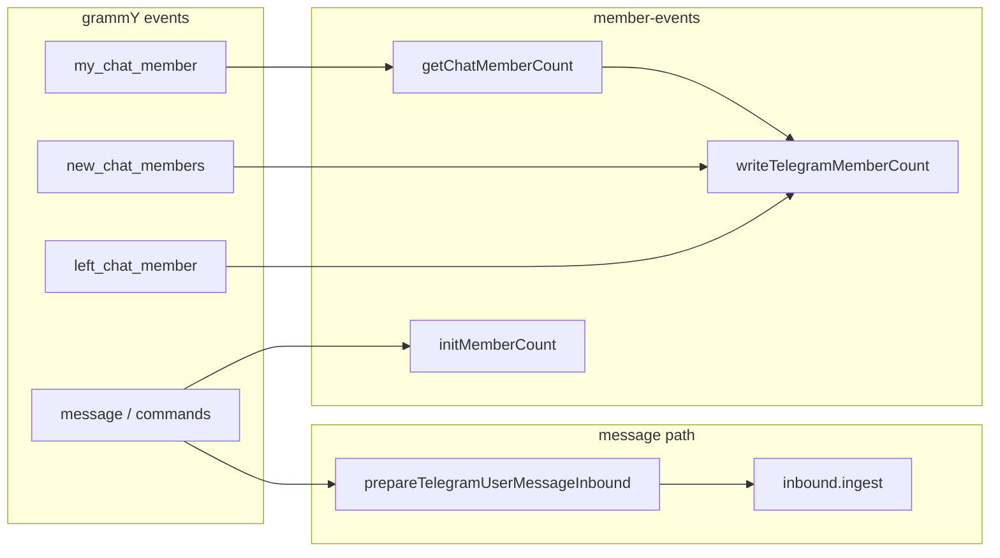
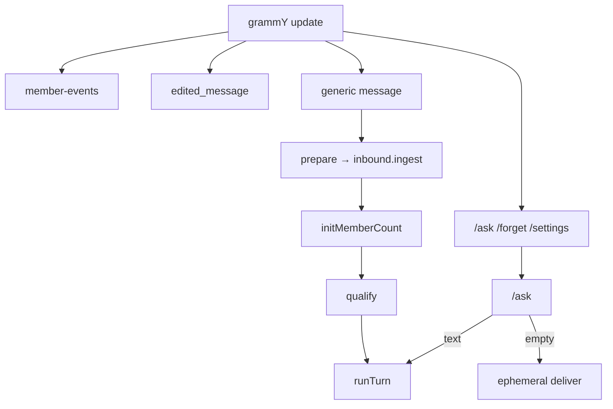

# Transport — Telegram

Telegram v0: grammY под `transport/telegram/`. Общие порты и термины — [transport](./index.md).

---

## Conversation identity ([#81](https://github.com/skepsik/utlas-ts/issues/81))

**Атом разговора** — `conversations.id` (uuid). Domain / turn / storage видят только uuid в `MessageRef.conversationId`. Transport склеивает wire key в `external_key`; decode — только здесь.

### `external_key`

| Случай | `external_key` | Пример |
|--------|----------------|--------|
| Любой чат без forum thread | `tg:{chat_id}` | `tg:-100123` |
| Forum topic (не General) | `tg:{chat_id}:t{thread_id}` | `tg:-100123:t42` |
| General (`message_thread_id === 1`) | без суффикса | `tg:-100123` |

Encode: `encodeTelegramConversationKey`. Decode: `decodeTelegramConversationKey` → `{ chatId, messageThreadId? }`. Egress: `telegramWireTarget(pg, conversationId)`.

`ensureTelegramConversation(pg, chat, threadId?)` — encode + title patch + `ensureConversation` ([#92](https://github.com/skepsik/utlas-ts/issues/92)); interim до [#99](https://github.com/skepsik/utlas-ts/issues/99).

Forum topic = **отдельная** row (свой uuid, watermark, settings). `member_count` / `dialog_arity` — denorm на chat-level и topic rows в PG (`writeTelegramMemberCount`). Qualifying / turn read — **chat-level** `telegramChatMembershipInfo` → `MembershipInfo.dialogArity`.

### Member events и `member_count`

| Источник | Действие |
|----------|----------|
| `my_chat_member` | `getChatMemberCount` → `writeTelegramMemberCount` (chat + topic rows) |
| `new_chat_members` | `+delta` от chat-level; **без API** |
| `left_chat_member` | `−1`; **без API** |
| `message` (turn-path) | после `inbound.ingest`: `initMemberCount` — идемпотентно по PG; **не** на `/ask` |
| `inbound.ingest` | **не трогает** count/arity |

**`initMemberCount`** (group/supergroup, generic `message`): chat-level null → API; forum topic row null при заполненном chat → backfill без API; иначе skip.

**Не делаем:** count на каждое сообщение; `api` через ingress; hub `TelegramRuntime` ([#88](https://github.com/skepsik/utlas-ts/issues/88)).

---

## Handler flow

Wiring в `createTelegramBot` — `ListenerDeps { inbound, outbound, … }`, без hub-класса ([#91](https://github.com/skepsik/utlas-ts/issues/91)).

`api` на message path **не** протаскивается. **Persist до gate** — сообщения без qualifying тоже в PG.

Generic `message` пропускает `message.text?.startsWith("/")` — interim ([#102](https://github.com/skepsik/utlas-ts/issues/102)).

### Commands ([#90](https://github.com/skepsik/utlas-ts/issues/90))

| Команда | Ingress | `runTurn` | Egress |
|---------|---------|-----------|--------|
| `/settings` | ensure row only | нет | `ephemeral` |
| `/forget` | нет | нет | `ephemeral` после watermark |
| `/ask` (пустой) | нет | нет | `ephemeral` |
| `/ask` (текст) | `inbound.ingest` | да (`fromAsk`) | `history` через turn |
| generic `message` | да | если qualify | `history` через turn |

`/ask` **вне** generic handler и **обходит** qualifying.

### Ingress

`prepareTelegramUserMessageInbound` → `ensureTelegramConversation` + `tgMessageToRef` + quote/forward → `inbound.ingest` (см. [InboundContext](./index.md) на hub-странице).

### Qualifying

`TelegramTurnQualifier.qualify(message, dialogArity)`; arity из `MembershipInfo`, не сырой `chat.type`.

| Условие | `via` |
|---------|-------|
| `private` arity | `private` |
| group + reply на бота | `reply_to_bot` |
| group + `@mention` | `mention` |
| group, иначе | `not_for_bot` |

### Egress

`createTelegramOutboundPort`: `telegramWireTarget`, HTML (`markdownToTelegramHtml`), chunking ([#101](https://github.com/skepsik/utlas-ts/issues/101)), `replyToMessageId` только на первый chunk.

Ephemeral вне turn: `outboundContextFromTelegramMessage` (**без** `replyToMessageId`).

**Map pin** ([#65](https://github.com/skepsik/utlas-ts/issues/65), [#107](https://github.com/skepsik/utlas-ts/issues/107)): `sendLocation` + inline Google/Yandex — [tools/composite](../tools/composite.md).

### Message lifecycle: edit / delete

| Событие          | v0                              | Политика                                                  |
| ---------------- | ------------------------------- | --------------------------------------------------------- |
| **Edit**         | `edited_message`                | `updateMessageText` — только `text`; **без** `runTurn`    |
| **Edit → пусто** | приходит                        | Канон: `text = ""`; **сейчас skip** в `edited-message.ts` |
| **Delete**       | Bot API не шлёт в private/group | Row **не удалять** — last-known snapshot                  |

Hard `DELETE` из `messages` — **не делаем**. Regen при edit — turn (**Later**).

---

## Открытые вопросы

| Тема | Суть |
|------|------|
| Command skip heuristic ([#102](https://github.com/skepsik/utlas-ts/issues/102)) | `startsWith("/")` vs `bot_command` entity в generic `message` |

---

## Later

| Тема | Суть |
|------|------|
| Empty edit → `text=""` | Канон очистки контента; сейчас skip в handler |
| Welcome on join ([#87](https://github.com/skepsik/utlas-ts/issues/87)) | Ephemeral при `new_chat_members`, вне turn |
| LLM regen on edit | Turn, не transport |
